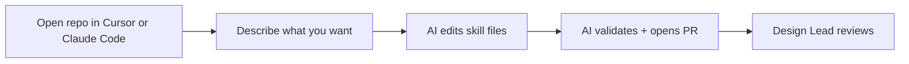

# Getting Started

This repo stores **Claude skills** — team instructions that tell Claude how to help with specific UX tasks (research plans, copy reviews, discovery tickets, etc.).

**Not sure what a skill is?** See [What is a skill?](#what-is-a-skill) below.

**Ready to contribute?** Pick the path that fits you:

| | **Beginner** | **Advanced** |
|---|---|---|
| **You** | New to skills, git, or this repo | Comfortable editing files directly in a cloned repo |
| **How you work** | Describe changes in Cursor or Claude Code — the AI handles files and git | Edit `SKILL.md` and `references/` yourself in Cursor, VS Code, or GitHub Desktop |
| **Guide** | [Path 1 below](#path-1-beginner-ai-assisted) | [Path 2 below](#path-2-advanced-edit-directly) |

Both paths end the same way: open a **Pull Request** → Design Lead reviews → merge.

---

## What is a skill?

A skill is a **folder of markdown files** that you upload to Claude. When active, it tells Claude:

- What questions to ask
- What structure to follow
- What team conventions to apply
- When to ask you instead of guessing

```
skills/research/research-plan/
├── SKILL.md              ← main instructions (required)
└── references/
    ├── EXAMPLES.md       ← real team examples
    └── TEMPLATES.md      ← copy-paste templates
```

**Skills support your judgment — they don't replace it.**

### Using a skill (no repo knowledge needed)

1. Open a skill folder on GitHub (e.g. `skills/research/research-plan/`)
2. Download the folder
3. In Claude: **Customize → Skills → Upload** → select the folder

When the repo is updated, re-upload the folder to get the latest version.

### Contributing a skill (changing the repo)

That's what the two paths below are for.

---

## Path 1: Beginner (AI-assisted)

**Best if:** you don't know git, haven't edited a skill before, or prefer to describe what you want in chat.

You work in **Cursor** or **Claude Code**. The AI creates/edits files, runs validation, and opens PRs for you.

### One-time setup

1. Install [Cursor](https://cursor.com/) or [Claude Code](https://docs.anthropic.com/en/docs/claude-code)
2. Clone this repo and open the folder
3. Tell the AI once:
   > Run the one-time setup for this repo (`npm install`)

### Daily workflow



**Update a skill:**
> Update the **research-plan** skill. Add a section about stakeholder alignment. Bump the minor version. Author: [Your Name].

Not sure which number to bump? See [Version numbers](#version-numbers).

**Create a skill:**
> Help me create a new skill called **research-synthesis** in **research**. It should guide synthesizing interview notes into themes. Author: [Your Name].

**Submit for review:**
> Validate my changes and create a pull request for review.

### Copy-paste prompts

**New skill:**
```
Create a new skill in skills/[category]/[skill-name]/.
It should help with [describe the task].
Author: [Your Name].
Follow CONTRIBUTION.md and copy from skills/_template/.
When done, run npm run validate.
```

**Update a skill:**
```
Update skills/[category]/[skill-name]/.
Changes: [what to add, fix, or remove].
Bump the version if the behavior changed.
Run npm run validate when done.
```

**Open a PR:**
```
Create a branch, commit my changes, push, and open a pull request.
Do not merge — I need Design Lead review first.
```

### What you never touch

The AI (and automation) handle these — you don't need to:

- `skills.json`
- README skill tables
- Anything in `scripts/`

---

## Path 2: Advanced (edit directly)

**Best if:** you're comfortable with a cloned repo, editing markdown files, and basic git (branch → commit → PR).

**Also read:** [CONTRIBUTION.md](./CONTRIBUTION.md) for skill writing quality, structure, and review checklist.

### One-time setup

```bash
git clone https://github.com/asgueto/ux-team-skills.git
cd ux-team-skills
npm install
```

Open the folder in **Cursor**, **VS Code**, or **GitHub Desktop**.

`npm install` sets up a pre-commit hook that auto-updates `skills.json` and README tables when you commit. If you skip it, GitHub Actions still runs the same checks on your PR.

### What you edit

```
skills/
├── _template/                    ← copy this to start a new skill
├── research/
│   └── research-plan/
│       ├── SKILL.md              ← you edit this
│       └── references/           ← and these
│           ├── EXAMPLES.md
│           └── TEMPLATES.md
├── design/
├── content/
└── process/
```

**Categories:** `research`, `design`, `content`, `process`

**Naming rules:**
- Folder name = frontmatter `name` = lowercase, hyphenated (e.g. `research-plan`)
- Do not use spaces or capitals in folder names

### What you never edit

| File | Why |
|---|---|
| `skills.json` | Auto-generated from your `SKILL.md` files |
| README skill tables | Auto-generated (between `<!-- SKILLS:*:START/END -->` markers) |
| `scripts/` | Repo tooling — not skill content |

If you edit these by hand, your next commit or PR will overwrite them.

### Add a new skill

#### 1. Create a branch

**Terminal:**
```bash
git checkout main
git pull
git checkout -b add/my-skill-name
```

**GitHub Desktop:** Branch → New branch → `add/my-skill-name`

#### 2. Copy the template

**Terminal:**
```bash
cp -r skills/_template skills/research/my-skill-name
```

Or duplicate `skills/_template/` in your file explorer and move it to `skills/[category]/[skill-name]/`.

#### 3. Edit the files

In `SKILL.md`:
- Set frontmatter `name` to match the folder name
- Write a `description` with trigger phrases ("help me…", "review this…")
- Set `**Version:** 1.0.0 | **Author:** Your Name`
- Write prescriptive steps — see [CONTRIBUTION.md](./CONTRIBUTION.md)

In `references/`:
- Add real examples to `EXAMPLES.md` (required)
- Add templates to `TEMPLATES.md` if useful
- Link all reference files from `SKILL.md`

#### 4. Validate

```bash
npm run validate
```

Fix any errors before committing. Common ones:

| Error | Fix |
|---|---|
| `name must match folder name` | Make frontmatter `name:` match the folder |
| `description is missing or too short` | Add trigger phrases to frontmatter |
| `missing version line` | Add `**Version:** 1.0.0 \| **Author:** Name` |
| `broken link references/FILE.md` | Create the file or remove the link |

#### 5. Commit and open a PR

```bash
git add skills/research/my-skill-name/
git commit -m "Add my-skill-name skill"
git push -u origin add/my-skill-name
```

Open a PR on GitHub. Fill in the checklist. Request Design Lead review.

### Update an existing skill

#### 1. Branch

```bash
git checkout main
git pull
git checkout -b update/research-plan-stakeholder-section
```

#### 2. Edit files

Only change files inside the skill folder:

```
skills/research/research-plan/
├── SKILL.md
└── references/
```

#### 3. Bump the version (if behavior changed)

See [Version numbers](#version-numbers) for when to bump patch, minor, or major.

#### 4. Validate, commit, PR

```bash
npm run validate
git add skills/research/research-plan/
git commit -m "Update research-plan: add stakeholder alignment section"
git push -u origin update/research-plan-stakeholder-section
```

### Git workflow (reference)

Always work on a **branch**, never commit directly to `main`.

| Step | Terminal | GitHub Desktop |
|---|---|---|
| Get latest | `git pull origin main` | Fetch origin |
| New branch | `git checkout -b update/my-change` | Branch → New branch |
| See changes | `git status` | Changes tab |
| Commit | `git commit -m "message"` | Summary + Commit |
| Push | `git push -u origin branch-name` | Push origin |
| PR | Open on GitHub | Create Pull Request |

**Commit messages:** plain language — `Add research-synthesis skill`, `Update prompt-builder: add FEEL examples`.

### Pre-PR checklist

- [ ] Only files under `skills/` changed (unless fixing repo tooling)
- [ ] Folder name matches frontmatter `name`
- [ ] `description` includes trigger phrases
- [ ] Version bumped if behavior changed
- [ ] All `references/` files linked from `SKILL.md` exist
- [ ] `npm run validate` passes
- [ ] Read `SKILL.md` aloud — would a teammate understand it?

Full quality checklist: [CONTRIBUTION.md](./CONTRIBUTION.md#review-checklist-for-reviewers)

### Useful commands

```bash
npm run validate           # Check all skills — run before every PR
npm run generate-manifest  # Manually regenerate skills.json + README (usually automatic)
```

### Using Cursor as an editor only

You don't have to use the AI. Advanced contributors can:

- Open the repo in Cursor
- Edit markdown files directly in the file tree
- Use the integrated terminal for `npm run validate` and git
- Ignore chat entirely

The AI instructions in [AGENTS.md](./AGENTS.md) won't interfere unless you ask for help.

### New to skills but want to learn by doing?

1. Read [CONTRIBUTION.md](./CONTRIBUTION.md) — especially the SKILL.md format section
2. Open an existing skill (e.g. `skills/research/research-plan/`) and read how it's structured
3. Make a small change on a branch (fix a typo, add an example)
4. Run `npm run validate`, open a PR, get feedback

---

## Version numbers

Every skill has a version in `SKILL.md` like `**Version:** 1.2.0 | **Author:** Your Name`. We use **semantic versioning** — three numbers written as `MAJOR.MINOR.PATCH` (often shown as `X.Y.Z`).

| Part | Name | What it means |
|---|---|---|
| First number (`X`) | **Major** | Big change — removed steps, reordered the whole process, or Claude will behave differently in ways that break how someone used the skill before |
| Middle number (`Y`) | **Minor** | New content — added a step, template, examples, or a new capability |
| Last number (`Z`) | **Patch** | Small fix — typo, clarification, wording tweak; nothing new for Claude to do |

### When to bump which number

| If you… | Bump | Example |
|---|---|---|
| Fix a typo or clarify wording (no new steps) | Patch (optional) | `1.1.0 → 1.1.1` |
| Add a section, template, or examples | Minor | `1.1.0 → 1.2.0` |
| Remove a step or restructure the process | Major | `1.1.0 → 2.0.0` |

**New skills** start at `1.0.0`.

**Major changes:** add a short **Migration Note** at the top of `SKILL.md` so teammates know what changed. Example:

> Migration Note (2.0.0): Step 3 was removed; use the new checklist in `references/TEMPLATES.md` instead.

Update the `**Version:**` line in `SKILL.md`. Do not edit `skills.json` or README tables — those update automatically on commit/PR.

- **Beginners:** tell the AI which bump you want (e.g. *"Bump the minor version"* or *"This is a major restructure — bump to 2.0.0 and add a Migration Note"*)
- **Advanced:** edit the version line yourself (see [Path 2](#path-2-advanced-edit-directly))

More detail: [CONTRIBUTION.md — Versioning](./CONTRIBUTION.md#versioning)

---

## Who approves changes?

Every change goes through a **Pull Request** reviewed by the Design Lead before it merges to `main`.

---

## Other guides

| Guide | For |
|---|---|
| [GETTING_STARTED.md](./GETTING_STARTED.md) | Everyone — pick your path (this file) |
| [CONTRIBUTION.md](./CONTRIBUTION.md) | Skill writing quality and structure |
| [AGENTS.md](./AGENTS.md) | AI instructions (Cursor / Claude Code read this automatically) |

Questions? Ask the Design Lead.
