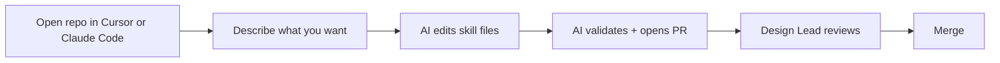

# Getting Started (for designers)

This repo stores **Claude skills** — instructions that help Claude work the way our UX team works.

**You edit skills in Cursor or Claude Code.** You talk to the AI in plain language; it handles file structure, git, and validation. You do not need to know git, code, or the command line.

---

## One-time setup

1. Install [Cursor](https://cursor.com/) or [Claude Code](https://docs.anthropic.com/en/docs/claude-code)
2. Clone this repo and open the folder:
   - **Cursor:** File → Open Folder → select `ux-team-skills`
   - **Claude Code:** `claude` in the repo folder (or open the folder in your terminal first)
3. Tell the AI once:
   > Run the one-time setup for this repo (`npm install`)

That's it. You only do this once per machine.

---

## Daily workflow



### Update an existing skill

Open the repo and say something like:

> Update the **research-plan** skill. Add a section about stakeholder alignment before writing goals. Bump the minor version. My name is [Your Name].

The AI will edit the right files, bump the version, validate, and offer to open a PR.

### Create a new skill

> Help me create a new skill called **research-synthesis** in the **research** category. It should guide researchers through synthesizing interview notes into themes. Author: [Your Name].

The AI will copy `skills/_template/`, write `SKILL.md` and reference files, validate, and open a PR.

### Submit for review

> Validate my changes and create a pull request for review.

The AI handles branches, commits, and the PR. You fill in the checklist when GitHub opens.

---

## Copy-paste prompts

Use these as starting points — edit the bracketed parts.

**New skill:**
```
Create a new skill in skills/[category]/[skill-name]/.
It should help with [describe the task in plain language].
Author: [Your Name].
Follow CONTRIBUTION.md and copy from skills/_template/.
When done, run npm run validate.
```

**Update a skill:**
```
Update skills/[category]/[skill-name]/.
Changes: [describe what to add, fix, or remove].
Bump the version if the behavior changed.
Run npm run validate when done.
```

**Open a PR:**
```
Create a branch, commit my changes, push, and open a pull request.
Use a clear commit message describing what changed.
Do not merge — I need Design Lead review first.
```

**Check before submitting:**
```
Run npm run validate and tell me if anything is wrong with my skill changes.
```

---

## What you edit vs. what the AI handles

| You describe in chat | AI handles automatically |
|---|---|
| What the skill should do | Creating/editing `SKILL.md` |
| Real examples and templates | Files in `references/` |
| When you're ready to submit | Branch, commit, push, PR |
| — | `skills.json` (skill index) |
| — | README skill tables |
| — | Validation checks |

**You never need to touch:** `skills.json`, README tables, or anything in `scripts/`.

---

## Install a skill in Claude (for daily use)

Contributing to the repo is separate from using a skill:

1. Open the skill folder in this repo (e.g. `skills/research/research-plan/`)
2. In Claude: **Settings → Skills → Upload** → select that folder
3. When the repo is updated, re-upload the folder to get the latest version

---

## Version numbers (tell the AI, or it will suggest)

| Change | Tell the AI |
|---|---|
| Typo or small fix | "Keep the version" or "bump patch to 1.0.1" |
| New section, template, or examples | "Bump minor version to 1.1.0" |
| Major restructure | "Bump major version to 2.0.0" |

---

## Who approves changes?

Every change goes through a **Pull Request** reviewed by the Design Lead before it merges to `main`.

Ask the AI for a draft PR early if you want feedback before finishing.

---

## Fallback: edit on GitHub

If you cannot use Cursor or Claude Code, you can still edit files in the GitHub browser (pencil icon → commit to a new branch → open PR). See [CONTRIBUTION.md](./CONTRIBUTION.md) for skill writing guidelines.

---

## More detail

- **Skill writing quality:** [CONTRIBUTION.md](./CONTRIBUTION.md)
- **AI instructions in this repo:** [AGENTS.md](./AGENTS.md) (Cursor and Claude Code read this automatically)
